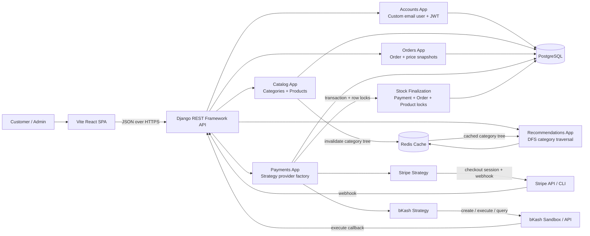

# System Architecture

## Runtime Flow

1. React calls DRF endpoints using JSON and JWT bearer tokens.
2. DRF separates responsibilities by domain apps: accounts, catalog, orders, payments, and recommendations.
3. PostgreSQL stores source-of-truth users, products, orders, order items, and payments.
4. Redis stores the active category tree used by DFS recommendations.
5. Payment initiation delegates to a provider strategy through the payment factory.
6. Successful Stripe webhook or bKash execute callback finalizes payment transactionally and reduces stock exactly once.

## Production Notes

- Secrets and infrastructure settings are loaded from environment variables.
- PostgreSQL is the final database target.
- Redis is used for category-tree caching.
- Payment success uses database transactions and row locks to protect stock consistency.
- Swagger/OpenAPI and Postman docs are included for reviewer testing.
