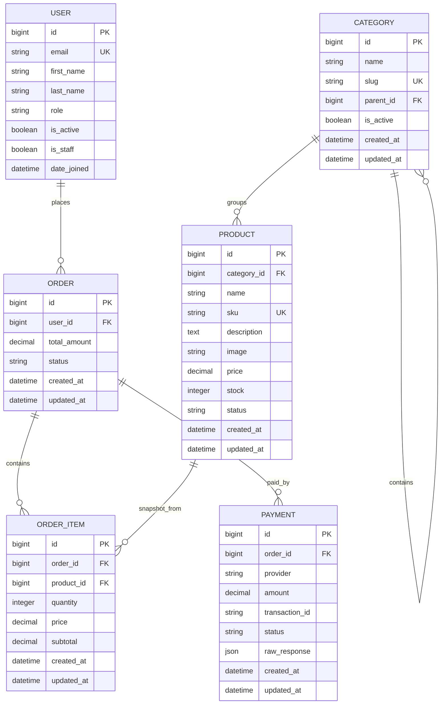

# Entity Relationship Diagram

## Important Constraints

- `USER.email` is unique and is the login identifier.
- `CATEGORY.slug` is unique.
- `CATEGORY.parent_id + CATEGORY.name` is unique to prevent duplicate sibling category names.
- `PRODUCT.sku` is unique and indexed.
- `ORDER_ITEM.price` and `ORDER_ITEM.subtotal` are immutable order-time snapshots.
- `PAYMENT.provider + PAYMENT.transaction_id` is unique when `transaction_id` is not blank.

## Stock And Payment Consistency

Order creation validates product status and available stock, but stock is reduced only after successful payment confirmation. Payment success locks the payment, order, and products inside one database transaction so repeated callbacks do not reduce stock twice.
