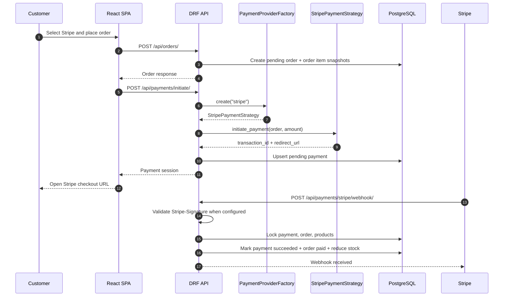
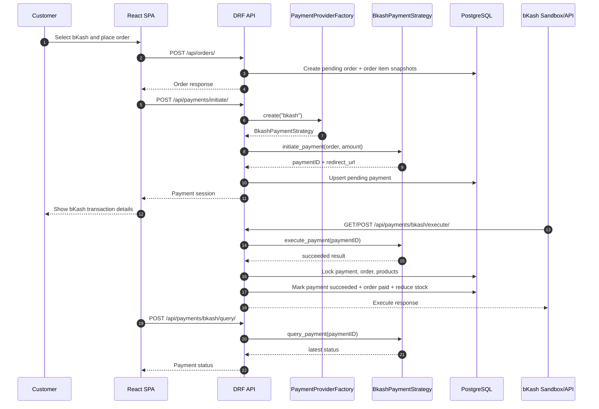

# Payment Flow Diagrams

## Stripe Checkout And Webhook Flow

## bKash Sandbox Execute And Query Flow

## Security And Consistency Notes

- Frontend never sends payable totals. The backend uses `Order.total_amount`.
- Provider-specific behavior is isolated behind `PaymentProviderStrategy`.
- `PaymentProviderFactory` chooses Stripe or bKash without leaking provider logic into views.
- Payment success uses database transactions and row locks.
- Duplicate success callbacks are idempotent and do not reduce stock twice.
- Stripe webhook signature validation is enforced when `STRIPE_WEBHOOK_SECRET` is configured.
- bKash query requires authentication and payment ownership, except staff users.
